# Rock, Paper, Scissors

This repository implements the famous game "Rock, Paper, Scissors" where both the player and the computer choose one of
the three symbols. The computer symbol is chosen randomly. Both symbols are compared to determine the winner:

- rock beats scissors
- paper beats rock
- scissors beats paper
- the same symbol results in a draw

##### Table of Contents

[Features](#features)

[Architecture](#architecture)

[Setup](#setup)

[Approach](#approach)

[Lessons learned](#lessons-learned)

[Next steps](#next-steps)

# Features

The implementation offers a couple of features, not limited to playing the game itself. Those features are illustrated
by the following screenshots, showing the mobile version of the app. This demonstrates that the app was developed
responsively with a mobile-first approach.

## Name selection

First, the user needs to enter a username. The "Play game"-button is only enabled once a name was entered.

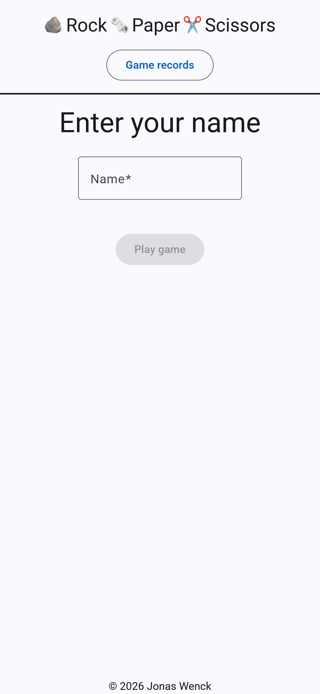
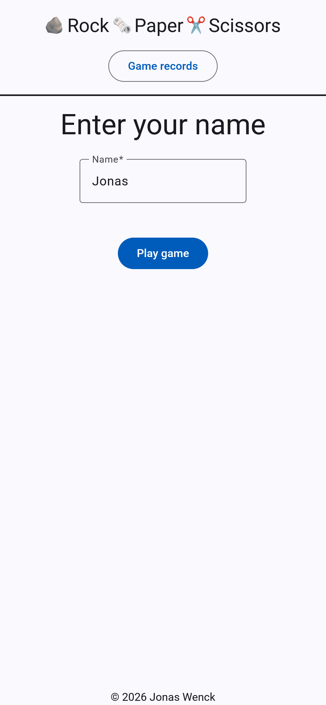

## Playing the game

Next, the user needs to select one of the three symbols. Tooltips explain the game rules. Clicking one of the symbols
triggers the random, server-side symbol selection for the opponent. The chosen symbols and the result are displayed. The
primary button offers the option to play again with the current username. The secondary button leads back to the
homepage to select a new username.

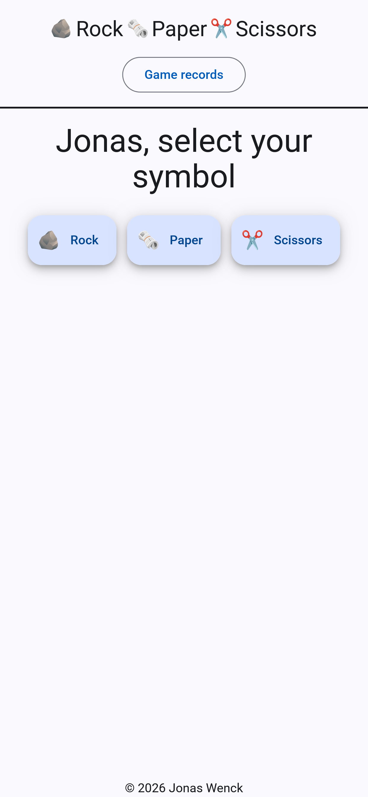
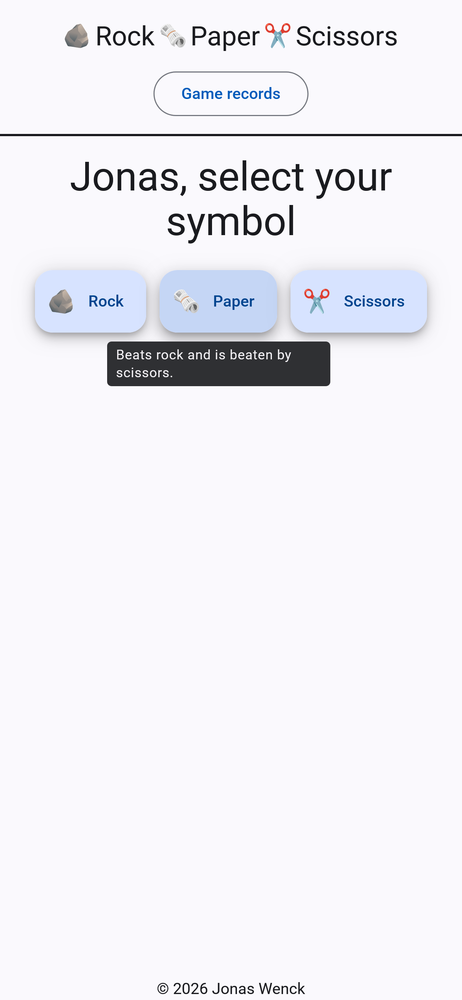
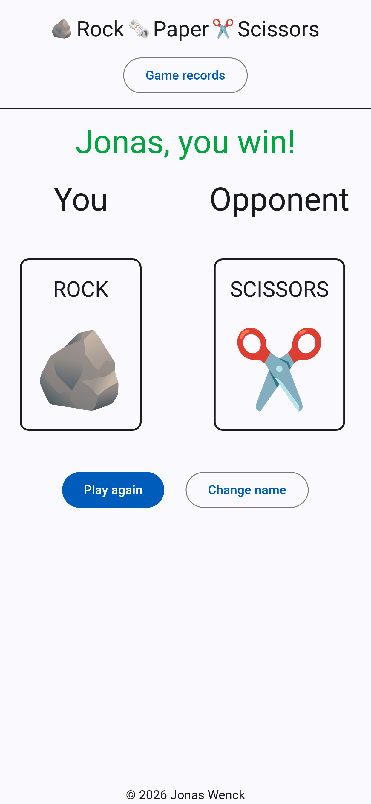

## Game records

A button in the header leads to the game records view. This view shows all games already played as each game is
persisted in a database.

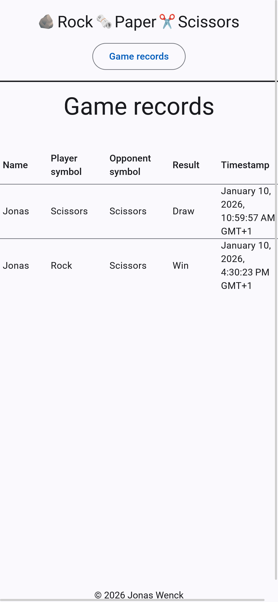

# Architecture

The application features a Spring Boot backend with a database (PostgreSQL in the docker-compose-setup and an embedded
H2 in the default setup) as well as a NestJS backend-for-frontend and finally an Angular frontend for the user
interaction. The following image shows the application as well as the control flow.

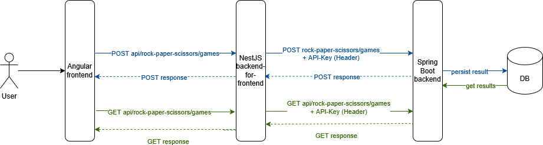

## Spring Boot backend

The Spring Boot backend is implemented as a stateless API. It offers a POST-endpoint that accepts the user input,
generates a symbol for the opponent and then determines the game result. The game result is persisted in the database.
All game records can be fetched via a GET request. The API is protected by an API key. Details about this backend can be
found [here](backend/README.md).

## NestJS backend-for-frontend

As the Spring Boot API is protected by an API key and Angular does not come with a backend like e.g. NextJS does, I
decided to implement a custom backend-for-frontend to not expose the API key in the browser as that would forfeit its
purpose. The backend-for-frontend is very slim and only adds the API-key header to the requests coming from the
frontend. Details
can be found [here](backend-for-frontend/README.md).

## Angular frontend

The Angular frontend renders the views for the user and allows interaction with the application. Both the POST and GET
requests are sent to the frontend-for-backend which in turn proxies them to the Spring Boot backend. Details can be
found [here](frontend/README.md).

# Setup

The three applications can be built and started independently as described in the previously linked README-files. CORS
and URL-configs are already present for each application.

A closer-to-production alternative is to run the [Docker-compose setup](docker-compose.yaml). It features a PostgreSQL
database and all docker files build their applications first so no NodeJS, Java or anything is required on the host
machine. To run the Docker compose-setup, simply create a [.env](.env) file at the root of this repository. None is
checked into Git to prevent leaking of sensitive information. The .env file needs to have the following properties. Both
values can be chosen as desired as they are referenced at all relevant locations in the docker-compose file.

```
DB_PASSWORD=132
API_KEY=456
```

The first prop secures the access from the Spring Boot backend to the database and the second secures the Spring Boot
API for the access by the backend-for-frontend. To run the docker-compose setup, Docker desktop needs to be installed on
the host machine.

After creating the .env file, simply run `docker compose up -d` to build and start all applications.

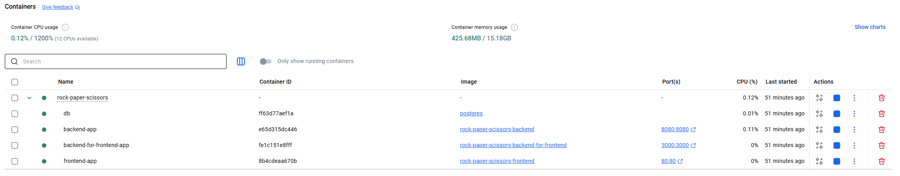

The client is available under http://127.0.0.1/.

# Approach

This project was started with some research and testing out various implementations available online. Then, I started
some wireframes of the desired product.

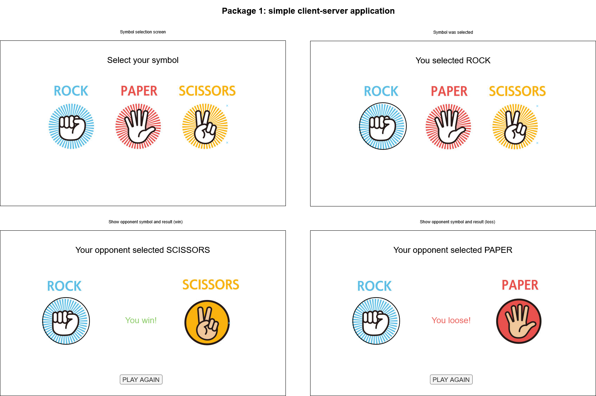

I envisioned various features for the application, set up a Git repo and created issues for those features.

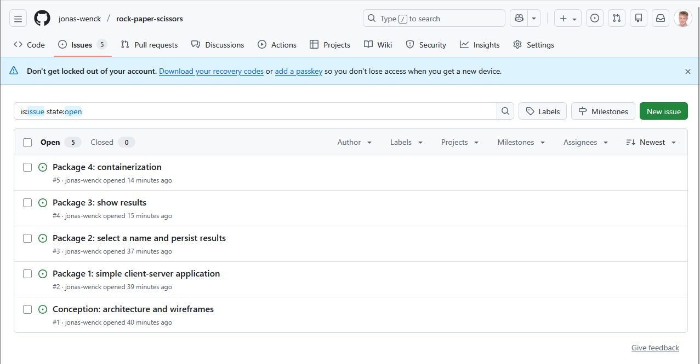

The first issue resulted in an architecture diagram similar to the one presented in
the [architecture section](#architecture) but without the backend-for-frontend.

# Lessons learned

As it was my first time working with both Angular and NestJS, I learned a lot of valuable lessons.

## #1: do not implement backend-for-frontend when not required

The backend-for frontend was, strictly speaking, not necessary. It only became somewhat necessary after I decided that
the Spring Boot API needed to be protected as I wanted to implement this project as close to production as possible
without deploying the applications somewhere.

An alternative to NestJS would have been to
use [Angular server-side rendering and proxy the requests there](https://angular.dev/guide/ssr). As the docker-compose
setup uses an Nginx instance to deliver the Angular frontend, it would have also been possible to proxy the API requests
via the Nginx and add the API key there. Another alternative would have been to not secure the Spring Boot API in the
first place but I did not choose that option on purpose.

## #2: define fewer features

Persisting the game records in a database and delivering them to the frontend was not really required but made sense as
additional features. Not implementing them would have saved a lot of time, but I am quite happy that I implemented them
as it allowed me to display a close-to-production Spring Boot API with a database.

## #3: work on docker-compose setup from the start

Instead of implementing the docker-compose setup as the last task, it would have been a good idea to implement it from
the start. This would have allowed me to realize the need for a Nginx sooner so I could have used that for the
production-build and simply not secure the API when running the apps in their dev-setups.

# Next steps

To bring this application from close-to-prodcution-ready to production-ready, the next steps would make sense.

## #1: decrease docker image sizes

Even though I am using multi-stage build for at least some of the apps, the docker images are still quite big:
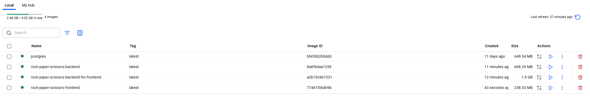

One option for the Spring Boot backend image would be to create a custom runtime only containing the required modules as
described [here](https://medium.com/@ievgen.degtiarenko/reduce-size-of-docker-image-with-spring-boot-application-2b3632263350).

## #2: get a second opinion

As this application was implemented in a team of one, it missed valuable input from other team members e.g. in the form
of pull requests.

## #3: perform both load and penetration testing

Before bringing a new application to production, it would be wise to perform both load and penetration testing. Load
testing could a) show if the application can handle the expected traffic and b) what sizing is required in a Kubernetes
setup. Penetration testing can show potential security issues before they can cause any harm.


