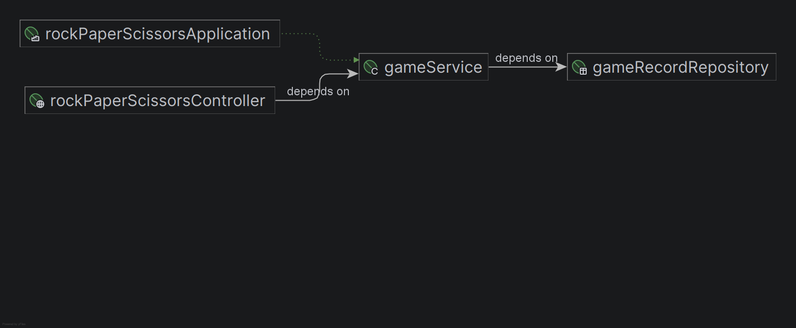
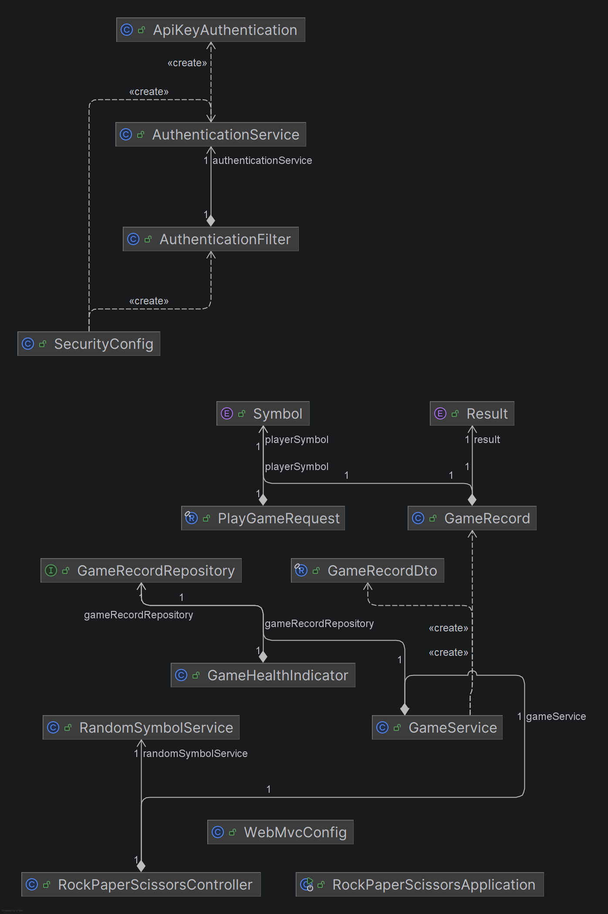
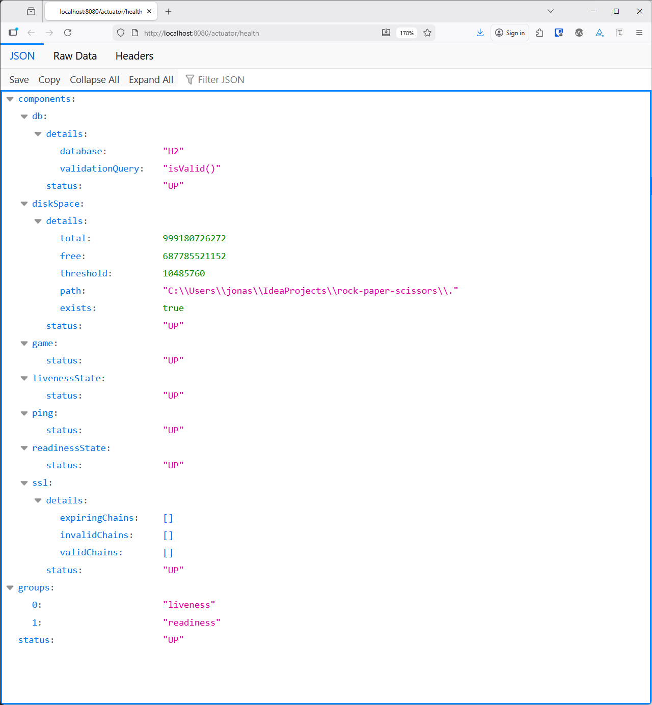

# Spring Boot backend

The Spring Boot backend offers a stateless REST API to play the game of Rock, Paper and Scissors.

## Architecture

It follows a controller-service-repository-pattern. The controller exposes the REST API and only uses services. Those
services implement the business functionality and optionally use a repository to access databases. The following diagram
visualizes these three layers.



The following diagram shows all backend components. In the top corner is the `SecurityConfig` which is responsible for
securing the application. The API-routes require an API-key and the actuator-routes are public. Both the
`SecurityConfig` as well as the `WebMvcConfig` (responsible for the CORS-config) are autowired into the
`RockPaperScissorsApplication`.

Below is the rest of the application which revolves around the `RockPaperScissorsController`. It uses the
`RandomSymbolService` to generate a random symbol for the opponent. This functionality was not included in the
`GameService` to make the implementation of JUnit tests easier and avoid excessive Mockito usage. The `GameService`
creates and consumes `GameRecord`-objects that are administered in the database via the `GameRecordRepository` and JPA.
The `GameRecord` entity-objects are contained within the service and not exposed to the controller. I use a clean
DTO-layer and transform the entities into `GameRecordDto`-objects before leaving the service layer. The relationship
between the `GameRecordRepository` and the `GameHealthIndicator` is required because the latter performs a simple query
to make sure that the database is not only up and running but contains a table for the `GameRecord` entity.



# Logging and observability

Logging is implemented for all relevant components with `org.slf4j.Logger` instances and appropiate log levels.

Spring default actuators as well as the custom `GameHealthIndicator` are exposed under `/actuator`. The health-actuator
shows some more details. Those details are not exposed in the close-to-production-ready docker-compose setup. The
integration of actuators allows us to communicate the liveliness and readiness states of our backend in a potential
Kubernetes setup so that the pod can be excluded from load balancing (readiness fails) or restarted (liveliness fails).



# Testing

Three tests were implemented to focus on different aspects of the application. The `RockPaperScissorsControllerTest`
mocks the
service-layer and verifies the JSON returned by the API for various success- and error-scenarios like missing or invalid
request bodies or API-keys. This tests the controller-layer as well as the security configuration. The `GameServiceTest`
works with an in-memory H2 database to test the game logic as well as the database integration. The
`RandomSymbolServiceTest` is a very simple JUnit test without any other components or mocks.

# Database

We use an embedded H2 for the standalone-setup and a PostgreSQL for the docker-compose-setup. Both databases are purely
configuration via `application.properties` or `docker-compose.yaml` so the application code is database-agnostic.

# Project setup

To build the application on its own, you need to have Gradle as well as a Java 25 JDK on the local machine. You need to
add a [secrets.properties](src/main/resources/secrets.properties) file to include the API-key with an arbitrary value:

```
api.key=someKey
```

Run `gradle build` to run all tests and build the application and use
the [run configuration](.run/RockPaperScissorsApplication.run.xml)
to run the application.

For the docker-compose setup, follow the [main README](../README.md).